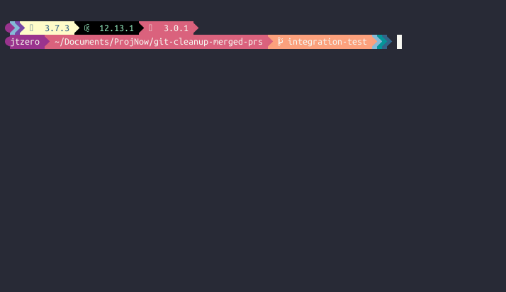

# Installation
  1. `mkdir "${HOME}/.git-hooks"`
  2. `git config --global core.hooksPath "${HOME}/.git-hooks"`
  3. `ln -nfs "${PWD}/git-cleanup-merged-prs-git-hook" "${HOME}/.git-hooks/post-checkout"`

# Usage as post-checkout hook
  

# Usage Info
  `bin/git-cleanup-merged-prs-git-hook help` OR `bin/git-cleanup-merged-prs help`

# API's supported
 - Github
 - GitLab
 - Azure
